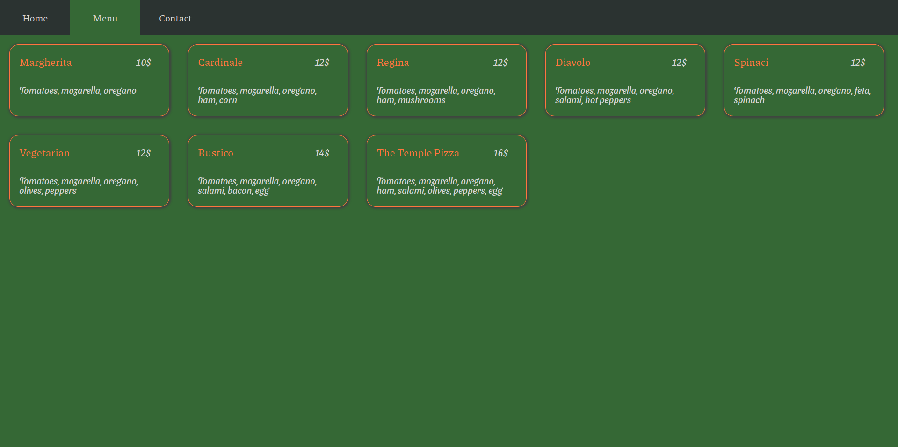

# Restaurant page

A simple restaurant page for the JavaScript curriculum at [The Odin Project](https://www.theodinproject.com). Yes, you read that right. It's in the JS-curriculum because all the content is created dynamically via JavaScript. This project is about DOM-manipulation and working with "real" JavaScript modules using webpack.

## Reflection

- This was my first time working with webpack. It went well and was fun.
- I found the JavaScript part quite easy this time, but I am not very pleased with the looks of the page. This project was a quick and dirty one.

## Built with

[webpack](https://webpack.js.org/)

## Demo

[View it here](https://reinimax.github.io/restaurant-page/)
